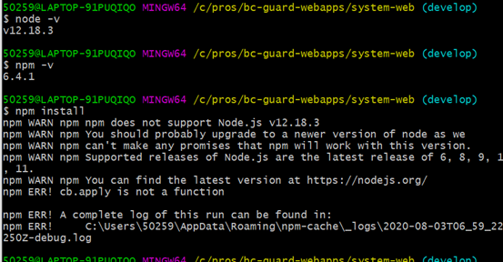
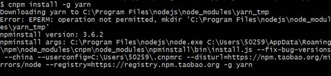
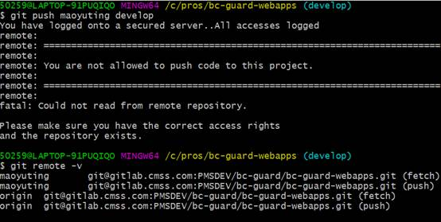

    
## 弹窗显示。要保证
 1、弹窗元素，position: absolute，父元素有relative
 2、父及以上组件是否设置了overflow: hidden 
3、z-index 足够高

## 对第三方组件通用处理
1、单独处理，引入组件，mixin.push(config) 先判断是否有mixin，没有则初始化。在push内部config 写vue options配置

## vuex store 中数据量大 本地环境卡顿，性能消耗很大
1、目前没有找到具体原因和解决办法
2、用bus 监听数据通信，在组件中data变量存储数据量大的对象或数组

## flex布局小坑
子元素显性定义height，改元素高度会被同级元素最大高度撑开到相同高度

## vue中父子组件生命周期渲染顺序
父beforeCreate -> 父created -> 父beforeMount -> 子beforeCreate -> 子created ->子beforeMount->子mounted-> 父mounted ->
父beforeUpdate->子beforeUpdate->子updated->父updated->
父beforeDestroy->子beforeDestroy->子destroyed->父destroyed

前端不受重视，因为做的都是自己人用，没有真正面向市场
用户量少，很多问题无法暴露，很多东西没有涉及到，比如前端性能优化
看看大公司，大用户量工作，面多大用户量使用情况下，需要考虑更多方面，性能优化

vue 中destroyed 生命周期中this还存在 需要研究一下源码

## prop默认值写法：
refAge: {
type: Number,
default: 0
},
refName: {
type: String,
default: ''
},
hotDataLoading: {
type: Boolean,
default: false
},
hotData: {
type: Array,
default: () => {
return []
}
},
getParams: {
type: Function,
default: () => () => {}
},
meta: {
type: Object,
default: () => ({})
}

## echarts 5.2.0 版本graph 系列 tooltip 的formatter 用callback  会有问题，5.1.1版本没问题

## setTimeout setInterval

- 如果时间间隔较小，或者执行方法内含有长时间的异步操作，比如接口请求，则第一选用setTimeout改写setInterval
- 如果需要暂定定时任务，最好使用const id = setInterval()，利用clearInterval(id)结束interval定时任务

## Nginx模拟http响应json

```
  #配置支持json返回
  location ~ ^/get_json {
    default_type application/json;
    return 200 '{"status":"success","result":"nginx json"}';
  }
```

## 编译报错 token.type.endsWith 填坑

就是type-list值这种换行写法模板解析可能有问题，导致eslint校验出错。按照图中改完就可以了，要么换成单行的，要么放在js中变量声明，模板中用变量。

```
<el-table
    :type-List="[{
        type: 'selection',
        width: 50
    }]"
    
// 改为
<el-table
    :type-List="[{type: 'selection', width: 50}]"
```

## echarts v4升级到v5版本，踩坑指南

- 全局引入方式改变 import * as echarts from 'echarts'
- 地图不在提供geojson相关文件，比如china.js，需要自己获取三方数据
- 仪表盘系列新增progress，动态进度条

## CSS :before、:after ，当content使用中文时有时候会出现乱码
1、确保HTML、CSS文件使用UTF-8格式，并且HTML文档也使用UFT-8的字符编码格式，即HTML文档的meta信息包含 <meta charset="UTF-8"> 。
2、避免在CSS的:before, :after中使用中文，如果一定要使用，可以使用中文对应的Unicode。可以使用使用站长工具（http://tool.chinaz.com/tools/unicode.aspx）的Unicode编码转换，或者是JavaScript的原生方法escape将中文转为Unicode。需要注意的是Unicode在CSS中的书写方式，例如“限量抢”对应的Unicode是'\u9650\u91cf\u62a2'，而在CSS中要写成 span:before { content: '\9650\91cf\62a2' } 。

## gulp4 更新，与gulp3区别
1、不要用Gulp3的方式指定依赖任务，你需要使用gulp.series和gulp.parallel，因为gulp任务现在只有两个参数。
2、gulp4中需要指定task结束
gulp4中，必须告诉gulp我们的task任务已经完成了。gulp3中，我们不必要这么做，因为如果没有发出异步完成信号，那么当任务返回时，gulp会认为它已经完成了，gulp4中必须明确指出任务完成了。
①  使用回调函数作为您的任务的第一个参数，只需在完成时调用该函数。
②  告诉gulp任务完成的另一个常见方法是 返回(return) 一个流或者** Promise**


##  commonJS 和 AMD 规范
commonJS 是同步加载模块，用于服务端，NodeJS 就是该模式。因为服务端都是在硬盘加载文件，加载文件时间就是硬盘响应时间，有缓存机制，加载第一次之后就从缓存中加载。
AMD 规范是异步加载 js 模块，用于浏览器 web客户端，requireJS 就是用该模式。


##  webapp 打包
1、gulp 可以压缩混淆css img js文件，生成对应目录的文件。但无法打包依赖文件的相互引用，无法模块化处理文件。
2、node_modules 依赖文件会套依赖文件，一层一层的，这里必须要用webpack 模块化打包。
3、webpack 模块化打包，可以通过入口文件，将require和 import 的 js 文件和css 文件通过模块化的方式打包合并成单个的js文件和css 文件。


##  在vue-cli 项目中 引入boostrap 报错 jQuery is not defined
在安装了 jquery ，并且在引入bootstrap 前，先引入了jquery，还是报错的话。还需webpack 配置plugins插件
plugins:[
        new webpack.ProvidePlugin({
		    $: "jquery",
      		    jQuery: "jquery",
      		    'window.$':'jquery',
      		    'window.jQuery':'jquery'
		})
 ]

参考： http://www.cnblogs.com/wyxxj/p/7381050.html


## IView tree使用踩坑
在使用懒加载时，nodeKey 会自动获取不到，callback 返回的数据，最好是单独声明过的变量

tree 节点需要换选中节点时，用 this.$refs.familyTree.handleSelect(item.nodeKey) ，nodeKey为唯一标识，handleSelect() 方法变更选中节点


## vue
v-model 和 :value 的值如果都是绑定的方法返回值或者计算属性，那在初始化编译时，v-model 就会报错。使用:value绑定则可以


## 关于依赖的版本号
1、^2.2.1中的^是指安装大于等于这个版本以上的2.x.x，比如2.3.1， 2.2.5，如果在当前项目和第三方依赖中都用了相同的依赖，如果当前工程依赖版本号有^开头，请注意依赖库的内部依赖版本号如果大于等于这个版本就不会安装
2、项目中和第三方依赖库内部依赖版本尽量保持一致，否则会出现问题。如echarts


## gitlab ip地址变更后，需要删除本地known_hosts里面的缓存信息
命令：ssh-keygen -R 域名（or ip）
## 更新node 不能windows 系统不能使用n指令，只能node官网下载安装，然后配置环境变量。
## 更新完node，npm版本还是之前的旧版本，安装依赖会报错。

[]()
解决：cnpm install -g npm
## 安装yarn 报错，没有权限。

[]()
使用管理员权限运行git bash，或者cmd
 
## 本地push 报错，要确定是否fork了远程仓库到自己仓库
[]()

## js 对象内部的函数属性简写
let person = {
    name: "jack",
    // ① 以前：
    eat: function (food) {
        console.log(this.name + "在吃" + food);
    },
    // ② 箭头函数版：
    eat2: food => console.log(person.name + "在吃" + food),// 这里拿不到this
    // ③ 简写版：
    eat3(food){
        console.log(this.name + "在吃" + food);
    }
}
       注意：这里的简写③其实等于①，与②不同，尤其在vue实例的computed 和watch中，不能用②，因为this不能指向实例。推荐写法③
## gitlab 远程仓库比自己fork项目更新，git pull 下来有冲突，解决冲突，提交代码，push到fork仓库，再新建merge request 合并到原始远程仓库。
 
## vue.js extends 允许声明扩展另一个组件 (可以是一个简单的选项对象或构造函数)
var CompA = { ... }
 
// 在没有调用 `Vue.extend` 时候继承 CompA
var CompB = {
  extends: CompA,
  ...
}
## css 多类选择器
在css类选择器中，多个类之间如果没有空格就表示是多类选择器，如
.class-a.class-b {color: red} ，这种表示同时具有class-a和class-b类的元素color为red。
而.class-a class-b{color: red} 是设置class-a类元素下面的所有class-b类的元素样式。
注意： .class-a, class-b {color: red} 这种以逗号分隔是分别设置class-a和class-b元素的color，一种简写
## 不要直接在html 中或者js 中直接用图片url，这样浏览器无法解析，需要外部先用require()根据路径解析出图片再赋值。如：
 
el.style.backgroundImage = ‘url('../assets/images/dataError.png')’ // 无法解析
 
const urlValue = require('../assets/images/dataError.png');
el.style.backgroundImage = `url('${binding.urlValue }')`  // 解析成功
